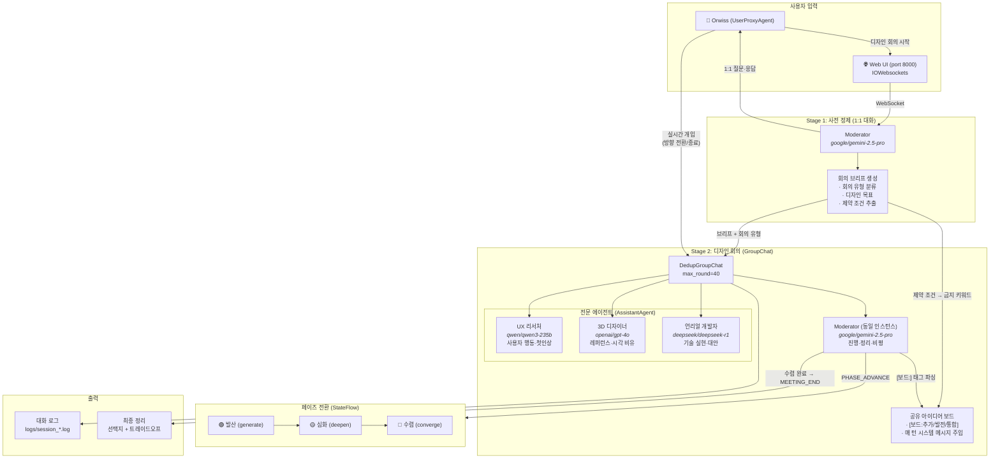
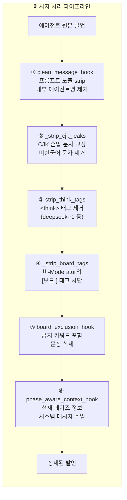
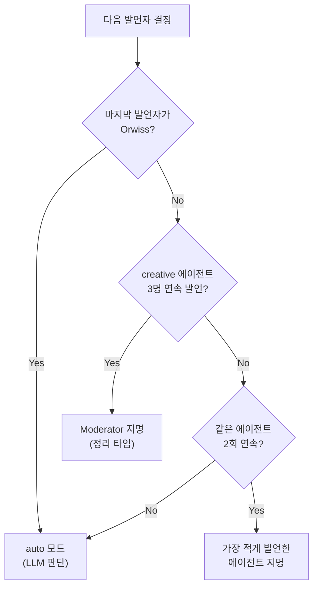
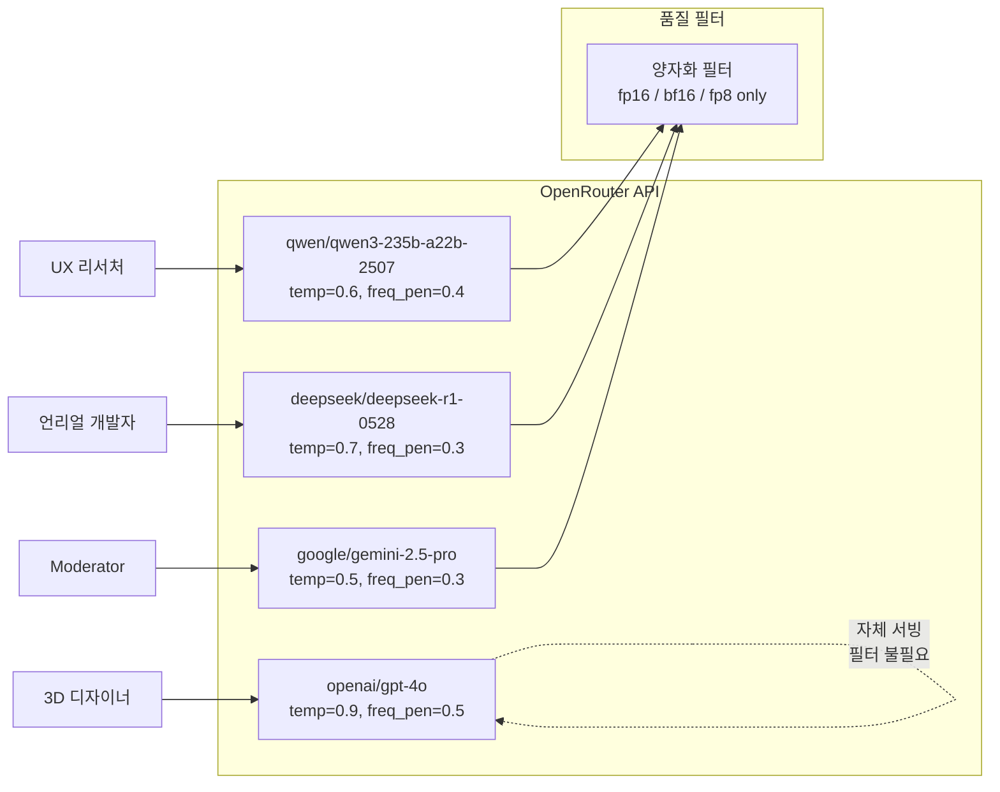
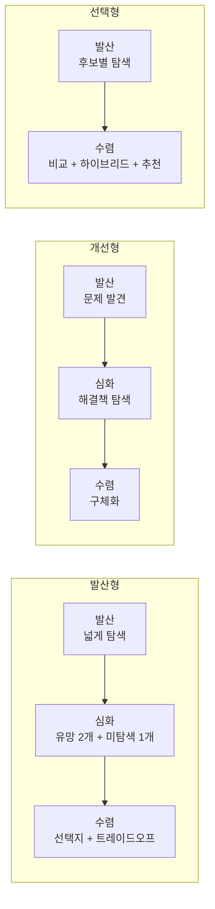
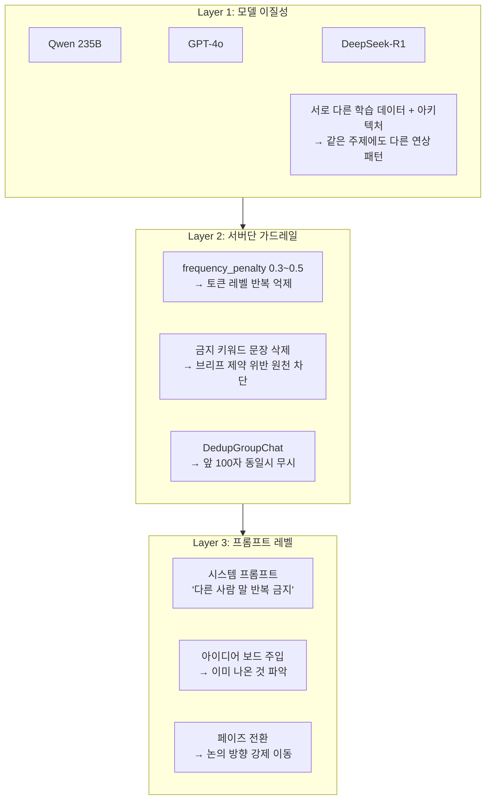

# 멀티 에이전트 디자인 회의 시스템 — 파이프라인 도식

## 1. 전체 파이프라인



## 2. 가드레일 시스템



## 3. Speaker Selection 로직



## 4. 모델 구성 (B안 프리미엄)



## 5. 회의 유형별 페이즈 흐름



## 6. 반복 방지 메커니즘



## 7. 파일 구조

```
agent-discussion/
├── web.py                    # 웹 서버 진입점 (IOWebsockets + HTTP)
├── main.py                   # CLI 진입점 (SocietyOfMind 버전, 구버전)
├── config.py                 # A안 모델 설정 (저가)
├── config_premium.py         # B안 모델 설정 (프리미엄, OpenRouter)
│
├── agents/
│   ├── moderator.py          # Moderator (Facilitator+Synthesizer 통합)
│   ├── simple_agents.py      # UX/3D/UE AssistantAgent (SocietyOfMind 없음)
│   └── preparer.py           # response_preparer callable (크로스복사 방지)
│
├── meeting/
│   ├── stage1.py             # Stage 1: 브리프 수집 (Moderator 1:1)
│   ├── stage2.py             # Stage 2: GroupChat + 페이즈 전환
│   ├── idea_board.py         # 공유 아이디어 보드
│   ├── speaker.py            # 페이즈별 speaker selection
│   └── guardrails.py         # 가드레일 (clean, CJK, 금지어, 페이즈 주입)
│
├── prompts/                  # 시스템 프롬프트 모음
├── logs/                     # 세션 로그
└── logs/clean/               # 정제된 대화 로그
```
